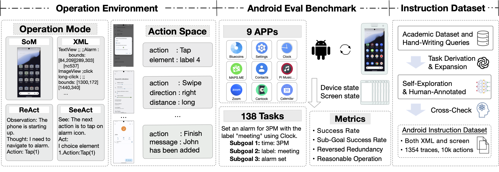
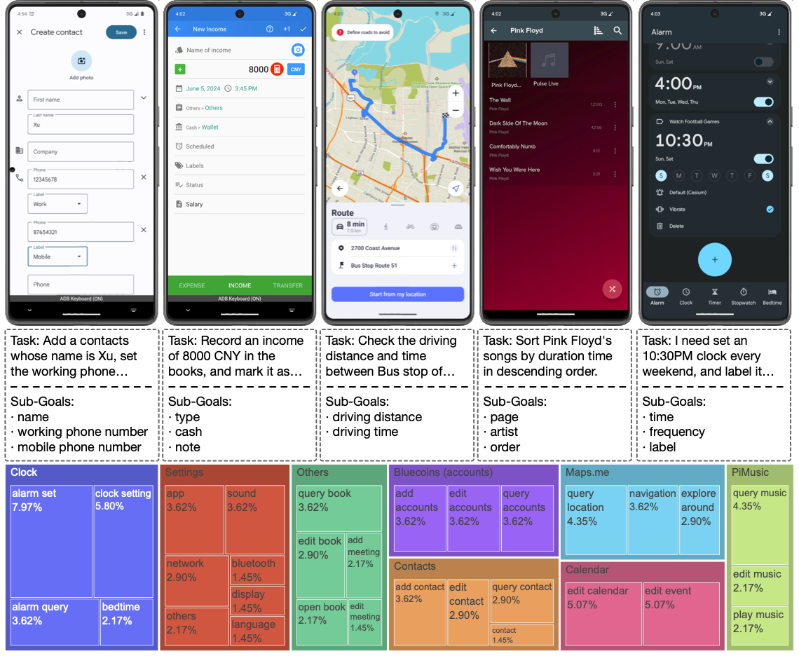
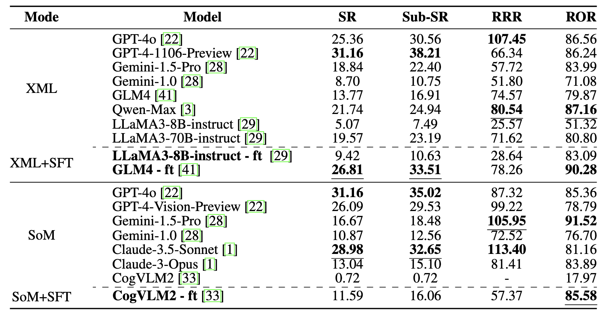

# Android Lab: Developing and Evaluating Android Agents in A Reproducible Environment

Chinese version of this README is available [here](README_CN.md).

Autonomous agents have become increasingly important for interacting with the real world. 
Android agents, in particular, have been a frequently mentioned interaction method in recent research. 
However, current benchmarks for evaluating Android agents still require further development. 
They lack a good combination of reproducibility and task difficulty. 
In this work, we propose Android Lab as a powerful Android agent framework. 
It includes an operation environment with operation modes and action space, as well as a reproducible benchmark---Android Eval. 
It supports both text-based and multi-modal models in the same action space. 
Android Eval comprises a set of predefined Android virtual images and 138 tasks across nine apps designed based on these images. 
By using this environment, we develop the Android Instruction dataset and train the LLaMA3-8B-instruct, GLM-4, and CogVLM2 (LLaMA3-8B) models on it. The trained models as Android agents are comparable to the best open and closed-source models, respectively. 

<p align="center">
    <a href="https://arxiv.org/abs/" target="_blank">📃 Paper </a> 
</p>

This repository is the code framework for the Android Eval section. We provide two execution modes: AVD on Mac (arm64) and Docker on Linux (x86_64). You can freely add or modify new tasks or Android images according to our framework. We offer a complete evaluation framework that can be used to assess the performance of various Android agents. We are also advancing the design of a more powerful open-source Android Agent, and we will release the complete training data and corresponding training code, along with checkpoints, once the data and training methods are finalized.



# Benchmark Components

In our experiment, we utilized a range of apps to conduct various tests. The following mobile apps are chosen:

- **Bluecoins**: A personal finance management app used for tracking expenses and income.
- **Calendar**: A calendar app helps in organizing schedules and setting reminders.
- **Cantook**: An e-book reader for storing, managing, and reading e-books.
- **Clock**: A clock app for displaying the time, setting alarms, and using a stopwatch.
- **Contacts**: A contact management app for storing and organizing contact information.
- **Maps.me**: An offline map app for navigation and exploring locations.
- **PiMusic**: A music player app for organizing and playing locally stored music files.
- **Settings**: A settings app for configuring device settings and preferences.
- **Zoom**: A video conferencing app for hosting and joining online meetings.

The selection of these apps underwent multiple iterations to ensure their suitability for our evaluation purposes. A key criterion for the final selection was that each app must function independently, without requiring an internet connection or user account login. This ensures that the evaluations can be consistently replicated under the same conditions, eliminating external dependencies and reducing the risk of privacy breaches. Consequently, this approach maintains the reliability and reproducibility of our results.


# Leaderboard

Main Result of XML and SoM modes. SR, Sub-SR, RRR, and ROR stand for Success Rate, Sub-Goal Success Rate, Reversed Redundancy Ratio, and Reasonable Operation Ratio, respectively. For all these metrics, a higher value means better. **-ft** represents an instruction tuning model. In each mode, **Bold** represents the best result, and **Underline** represents the second-best result.




# Quick start

## Auto Evaluation Pipeline

We offer two testing methods: AVD on Mac (arm64) and Docker on Linux (x86_64).

### Prerequisites

Clone this repo and install the dependencies.

```bash
cd /path/to/your/repo
conda create -n Android-Lab python=3.11
conda activate Android-Lab
pip install -r requirements.txt
```

If you use AVD on Mac (arm64), please refer to [here](docs/prepare_for_mac.md) to set up the environment.

If you use Docker on Linux (x86_64), please refer to [here](docs/prepare_for_linux.md) to set up the environment.

### Run the Auto Evaluation Pipeline

To test, run:

```bash
python eval.py -n test_name -c your path to config.yaml
```

The specific output of each question is saved under `./logs/evaluation/test_name`, and the evaluation results are saved
in the `output` folder.
If you only want to run a few questions for testing, you can refer to:

```bash
python eval.py -n test_name -c your path to config.yaml --task_id taskid_1,taskid_2,taskid_3
```

We support parallel testing. Please note that you need to confirm in advance that
you have sufficient memory and storage. Each concurrent session takes up approximately 6G of memory and 9G of storage
space.

```bash
python eval.py -n test_name -c your path to config.yaml -p 3
```

The corresponding task_id for each question can be found in `evaluation/config`.

Use the following code to generate evaluation results:

```bash
# eval by gpt-4o-2024-05-13:
export OPENAI_API_KEY='your-api-key-here'
python generate_result.py --input_folder ./logs/evaluation/ --output_folder ./logs/evaluation/ --output_excel ./logs/evaluation/test_name.xlsx --judge_model gpt-4o-2024-05-13

# eval by glm4:
python generate_result.py --input_folder ./logs/evaluation/ --output_folder ./logs/evaluation/ --output_excel ./logs/evaluation/test_name.xlsx --judge_model glm4 --api_key your api key
```

You need to fill in your judge model and api_key(may be api_base, too). We now support gpt-4o-2024-05-13 and glm4.
generate_result.py will generate an Excel file of all test results under --input_ir, containing detailed results for each question.

## How to Modify the Backbone Model

The `Agent` class has been predefined in the `agent/` folder, with implementations for the OpenAI interface based on
oneapi and the currently deployed GLM interface. If you need to add a base model, you need to:

1. Create a new Python file under the `agent/` directory, and refer to `agent/model/OpenAIAgent`. Implement your model call by inheriting the `Agent` class. The `act` function input is already organized according to the OpenAI message format, and the output should be a string. If the input format of the corresponding model differs from OpenAI, you can refer to the `format_history` function in `claude_model` and the `prompt_to_message` function in `qwen_model` for modifications. `format_history` can organize the format of historical records, and the `prompt_to_message` method converts the prompt and image input (if any) of the current turn into the single-turn format of the current model.
2. Import your new class in `agent/__init__.py`.
3. Replace the content under `agent` in the config file used by `eval.py` with:

```yaml
agent:
    name: Your Agent Module Name
    args:
        max_new_tokens: 512
```

Make sure the name matches your implemented class name, and the content under `args` will be passed to your
class's `init` function.

## Steps to Add a New Task

During the process of writing a new task, it is equally important to write and use the code to determine if your code is
correct through actual running results. Therefore, please follow the steps below to ensure each new task is error-free.

1. Write your task. Tasks include yaml files, evaluation methods, and corresponding mobile app installation.
    1. The task's yaml file should refer to other existing files under `evaluation/config` and must
       include `task_id`, `task`, `metric_type`, and `metric_func`. `adb_query` is only used when the results need to be
       queried using adb commands. Although `category` is not yet in use, it is strongly recommended to add it.
    2. The evaluation method needs to inherit the `evaluation/task/SingleTask` class. After each recorded operation,
       the `judge` function will be executed, and its return value is a
       dict: `{"judge_page": bool, "1": bool, ..., "complete": bool}`. The code will record the judgment result of the
       last page where `judge_page` is `True`, and `complete` should only be set to `True` if all judgment points are
       correct. If it's a task that compares return values, the `check_answer` method has already been implemented.
       Modify `final_ground_truth` to the standard answer before calling this function.
    3. Refer to other tasks, import all evaluation methods in `evaluation/app_name/__init__.py` into the `function_map`
       class.
    4. To ensure the model can execute the launch command correctly, add the app name and corresponding package name
       in `templates/packages/apps_dict`. The package name can be obtained by
       executing `adb -s {device} shell dumpsys window | grep mCurrentFocus | awk -F '/' '{print $1}' | awk '{print $NF}'`.
2. Execute your task using at least the most advanced agent and generate evaluation results. If necessary, quickly
   complete the correct operation during model operation intervals to ensure that the recorded operation can capture the
   correct result page between two model operations to test if your code can complete the detection task.
3. Use the `tools/check_result_multiprocess.py` function to generate screenshots of each step. Focus on checking whether
   the screenshots of correct model operations are indeed judged as correct.

## Steps to Change AVD Snapshot

If you want to define a mobile snapshot different from the android eval snapshot, you need to follow these steps:

1. Download related docker files from the
   link: https://drive.google.com/file/d/1xpPEzVof5hrt5bQY6BHm_4Uoyq5mJQNb/view?usp=drive_link
2. Extract the file, enter the extracted folder, and then run:

```bash
docker build -t android_eval_no_avd:latest .
```

3. Configure your AVD snapshot on an x86_64 machine (it is recommended to configure it directly using Android Studio).
   Note that the default installed Android AVD type is:

```dockerfile
RUN /bin/bash -c "source /root/.bashrc && yes | sdkmanager 'platform-tools' 'emulator' 'system-images;android-33;google_apis;x86_64'"
RUN /bin/bash -c "source /root/.bashrc && yes | sdkmanager 'build-tools;33.0.0'"
RUN /bin/bash -c "source /root/.bashrc && yes | sdkmanager 'platforms;android-33'"
```

If you want to configure the AVD for a different version, please modify the specific version number installed in the
Dockerfile. Note that the version number must be strictly consistent, otherwise, the installed image will not be able to
read the existing cache.

4. You can use the following code to generate the AVD image used in the docker:

```python
python tools/modify_mobile_to_docker.py 
    --avd_dir /Path/to/your/.android/avd 
    --device_name your device name 
    --save_dir /Path/to/your/save/avd
```

Alternatively, you can modify it as follows:

Find your .avd folder and .ini file through Android Studio -> Virtual Devices Manager -> Right-click -> Show on Disk,
and make the following modifications:

In Pixel_7_Pro_API_33.ini, modify path and path.rel to the following paths:

```ini
avd.ini.encoding=UTF-8
path=/root/.android/avd/device name.avd
path.rel=avd/device name.avd
target=android-33
```

In Pixel_7_Pro_API_33.avd/config.ini, modify the following paths:

```ini
...
image.sysdir.1 = system-images/android-33/google_apis/x86_64/
...
skin.path = /root/.android/skins/pixel_7_pro
...
```

Keep the other contents unchanged.

5. Start an image and copy your .avd folder and .ini file into the image:

```bash
docker run -it  android_eval_no_avd:latest /bin/bash 
docker cp /path/to/your/device name.avd container_id:/root/.android/avd
docker cp /path/to/your/device name.ini container_id:/root/.android/avd
```

After completing the above, you can execute the following in the image:

```bash
emulator -avd device name -no-window -no-audio -no-snapshot-save
```

Verify whether the installation is successful.


